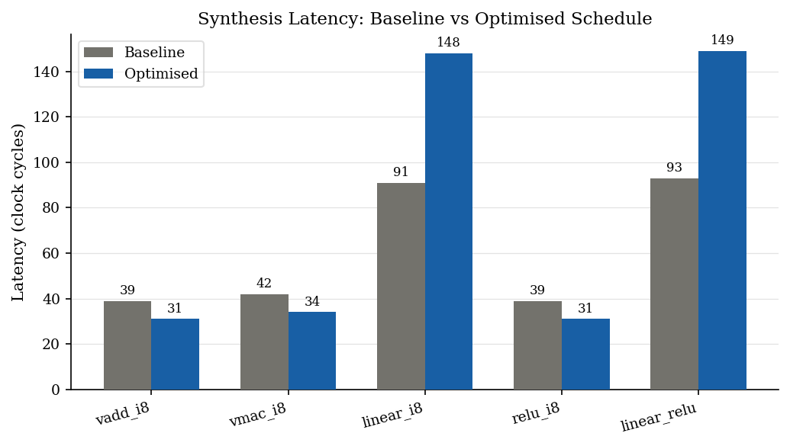
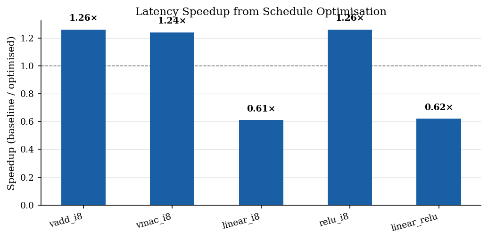
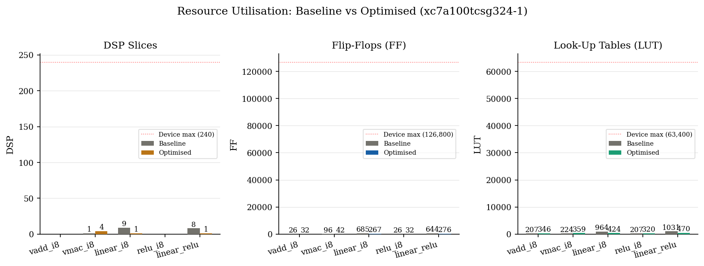
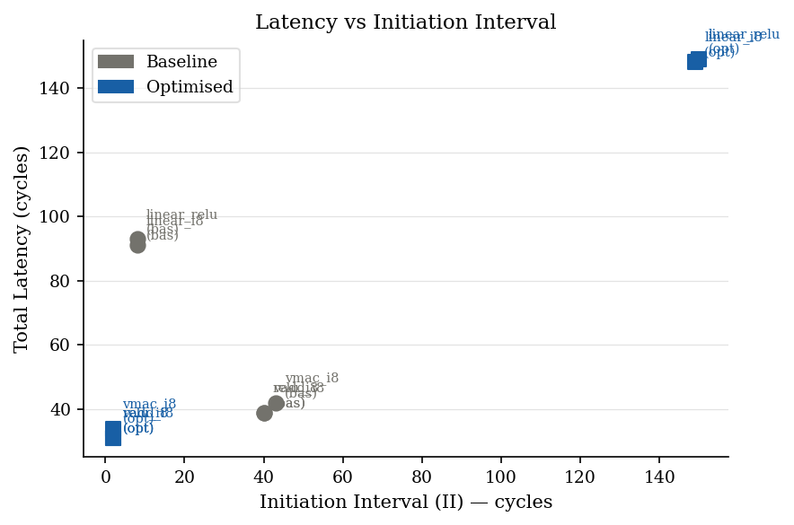

# VPU Allo — AI Workload Accelerator (Spring 2026)

Continuation of the Fall 2025 VPU research ([vpu-rtl](../vpu-rtl/)).

**Fall 2025:** hand-written SystemVerilog VPU core, VADD\_I8 validated (VL=16, LANES=4) in Vivado XSim.

**Spring 2026:** same workloads expressed in the [Allo DSL](https://github.com/cornell-zhang/allo) (Python → MLIR → Vitis HLS C++ → RTL), extended to VMAC, a full INT8 linear layer (GEMM), ReLU, and a fused linear+ReLU layer. All 10 designs synthesised with Vitis HLS 2025.1 on the Nexys A7 Artix-7 100T.

---

## Key Findings

Synthesis was run on all 10 HLS designs (5 kernels × 2 schedules) targeting `xc7a100tcsg324-1` at 100 MHz.

| Kernel | Baseline (cyc) | Optimised (cyc) | Speedup | DSP base→opt |
|---|---|---|---|---|
| `vadd_i8` | 39 | 31 | **1.26×** | 0 → 0 |
| `vmac_i8` | 42 | 34 | **1.24×** | 1 → 4 |
| `linear_i8` | 91 | 148 | 0.61× | 9 → 1 |
| `relu_i8` | 39 | 31 | **1.26×** | 0 → 0 |
| `linear_relu` | 93 | 149 | 0.62× | 8 → 1 |

**SIMD kernels** (vadd, vmac, relu): the `split(4) → unroll(inner) → pipeline(outer)` schedule reduces latency by 1.21–1.26× with II=1 on the outer loop.

**Linear-layer kernels**: the `buffer_at + pipeline(k)` schedule is *slower* at these small dimensions (M=8, K=16) because the HLS tool already auto-unrolls the baseline into a fully-parallel 9-DSP multiply tree. The optimised schedule serialises this into a single-DSP pipelined accumulator, a 9× DSP reduction at the cost of 1.63× higher latency. This tradeoff reverses at larger dimensions where DSP budget becomes the binding constraint (primary motivation for VCU128 migration).

**Fused vs. unfused linear+ReLU**: fusion adds only 2 cycles (2.2%) and reduces DSP by 1 slice, confirming that kernel fusion is effective at this scale.

<div align="center">

<table style="border-collapse: collapse; border: none;">
  <tr style="border: none;">
    <td align="center" style="border: none;">
      <br>
      <b>Latency Comparison</b>
    </td>
    <td align="center" style="border: none;">
      <br>
      <b>Speedup Factor</b>
    </td>
  </tr>
</table>

<br><br>

<table style="border-collapse: collapse; border: none;">
  <tr style="border: none;">
    <td align="center" style="border: none;">
      <br>
      <b>Resource utilisation (DSP / FF / LUT)</b>
    </td>
    <td align="center" style="border: none;">
      <br>
      <b>DSP % of device</b>
    </td>
  </tr>
</table>

<br><br>

<br>
<b>Design Space</b>

</div>


*All figures generated by `reports/plot_results.py` from Vitis HLS `csynth.rpt` files.*

---

## Repository Layout

```
vpu_allo/
│
├── models/
│   └── golden.py                   # NumPy reference models + scratchpad pack/unpack helpers
│
├── kernels/
│   ├── vadd.py                     # INT8 vector addition  (regression baseline vs Fall 2025)
│   ├── vmac.py                     # INT8 multiply-accumulate  (scaffolded in Fall 25, now validated)
│   ├── linear.py                   # INT8 GEMM linear layer
│   └── relu.py                     # INT8 ReLU + fused linear+ReLU
│
├── schedules/
│   ├── schedule_baseline.py        # No pragmas — HLS tool optimises freely
│   └── schedule_opt.py             # split / unroll / pipeline / buffer_at
│
├── sim/
│   ├── generate_hls.py             # Generates HLS C++ for all kernels × schedules
│   ├── tb_driver.py                # Generates scratchpad preload .txt / .mem files
│   └──hls_output/                  # (generated) 10 HLS C++ files
│
├── tests/
│   ├── test_vadd.py                # VADD regression suite — mirrors Fall 25 TB output
│   └── test_kernels.py             # VMAC, linear, relu, fused — 332 test cases total
│
├── reports/
│   ├── run_hls_windows.ps1         # batch Vitis HLS synthesis (Windows Powershell)
│   ├── run_hls_wsl2.sh             # batch Vitis HLS synthesis (Linux)
│   ├── parse_reports.py            # Parses csynth.rpt → Markdown / CSV / JSON table
│   ├── plot_results.py             # Parses all rpt files → 5 matplotlib figures
│   ├── synth_reports/              # (generated) csynth.rpt per kernel/schedule
│   │   ├── vadd_baseline/
│   │   ├── vadd_opt/
│   │   ├── vmac_baseline/
│   │   ├── vmac_opt/
│   │   ├── linear_baseline/
│   │   ├── linear_opt/
│   │   ├── relu_baseline/
│   │   ├── relu_opt/
│   │   ├── linear_relu_baseline/
│   │   └── linear_relu_opt/
│   └── figures/                    # (generated) fig1–fig5 PNGs + synthesis_data.json
│
├── run_1.py                        # runs step 1-3 in quick start (runs in docker env)
└── run_2.py                        # runs step 4-5 in quick start (runs in powershell)
```

---

## Allo Installation

```bash
# Pull the Allo Docker image
docker pull chhzh123/allo:latest

# Mount your project folder into the container
docker run --rm -it \
  -v ~/allo:/workspace/allo \
  -v "/path/to/Spring 2026":/workspace/vpu \
  chhzh123/allo:latest

# Inside the container — install Allo from source
cd /workspace/allo && python3 -m pip install -v -e .
```

---

## Quick Start

### Step 1 — Golden model test *(no Allo or Vivado needed)*
```bash
python3 models/golden.py
```
Expected: 
```
=== VADD_I8 (regression — matches Fall 25 golden) ===
a: [0, 1, 2, 3, 4, 5, 6, 7, 8, 9, 10, 11, 12, 13, 14, 15]
b: [0, 2, 4, 6, 8, 10, 12, 14, 16, 18, 20, 22, 24, 26, 28, 30]
y: [0, 3, 6, 9, 12, 15, 18, 21, 24, 27, 30, 33, 36, 39, 42, 45]
  word[0] = 09060300
  word[1] = 15120f0c
  word[2] = 211e1b18
  word[3] = 2d2a2724

...
=== LINEAR_RELU_I8 (fused) ===
y (INT8, post-ReLU): [0, 0, 0, 8, 37, 0, 0, 0]
```

### Step 2 — Functional tests via LLVM *(no Vivado needed, in Docker)*
```bash
python3 -m pytest tests/ -v
```
Expected: `32 passed` in ~4 seconds.

### Step 3 — Generate HLS C++ *(no Vivado needed, in Docker)*
```bash
python3 sim/generate_hls.py --hls-only
# Writes: sim/hls_output/<kernel>_<schedule>.cpp  (10 files)
```
Expected:
cpp files generates as seen in [sim/hls_output](sim/hls_output/)

### Step 4 — Run Vitis HLS synthesis *(requires Vitis HLS 2025.1)*

From Windows (run in project root folder):
```powershell
powershell -ExecutionPolicy Bypass -File reports/run_hls_windows.ps1
```

Expected output (one block per kernel):
```
[vadd_baseline] top=vadd_i8
  exit code: 0
  -> done
...
[linear_relu_opt] top=linear_relu_i8
  exit code: 0
  -> done
```

Reports saved to `reports/synth_reports/<kernel>/csynth.rpt`.

Example: [reports/synth_reports/linear_opt/csynth.rpt](reports/synth_reports/linear_opt/csynth.rpt)

### Step 5 — Parse results and generate figures
```bash
python3 reports/plot_results.py \
    --report-dir reports/synth_reports \
    --out-dir    reports/figures/
```

Writes 5 PNG figures and `synthesis_data.json` to [reports/figures/](reports/figures/).

---

## Architecture Parameters

| Parameter | Value | Notes |
|---|---|---|
| VL    | 16 | Vector length (INT8 elements) — matches Fall 2025 |
| LANES | 4  | Parallel ALU lanes — matches Fall 2025 V\_ALU[0..2] |
| M     | 8  | Linear layer output features |
| K     | 16 | Linear layer input features |
| Part  | xc7a100tcsg324-1 | Nexys A7 Artix-7 100T |
| Clock | 100 MHz (10 ns)  | Same as Fall 2025 target |

---

## Connection to Fall 2025 Work

| Fall 2025 (SystemVerilog) | Spring 2026 (Allo) |
|---|---|
| Hand-written `vpu_core.sv` | `allo.customize()` → Vitis HLS C++ → RTL |
| `VADD_I8` validated in Vivado XSim | `kernels/vadd.py` — 39 cyc (baseline), 31 cyc (opt) |
| `vmac` scaffolded, not synthesised | `kernels/vmac.py` — 42 cyc (baseline), 34 cyc (opt) |
| Scratchpad FSM (SET/GET states) | `allo.reduction()` + `buffer_at()` |
| `tb_sp_*` preload interface | `sim/tb_driver.py` generates `$readmemh` `.mem` files |
| Nexys A7 (xc7a100tcsg324-1) | Same part, same 100 MHz clock, Vitis HLS 2025.1 |
| Vivado XSim co-simulation | RTL co-sim deferred; LLVM validation complete |

---